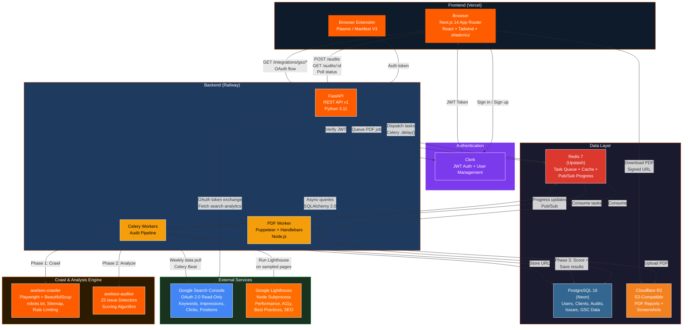

# AxelSEO — System Architecture



## Data Flow Summary

### Audit Pipeline (user submits URL)
```
Browser → POST /api/v1/audits → FastAPI → Celery .delay() → Redis Queue
    → Worker picks up task
    → Phase 1: Crawler (Playwright BFS, up to 500 pages)
    → Phase 2: Auditor (25 detectors, Lighthouse on 5 sampled pages)
    → Phase 3: Save scores + issues to Postgres
    → Status updates via Redis Pub/Sub → Browser polls every 3s
```

### PDF Report Generation
```
Browser → POST /api/v1/reports/generate → Redis Queue
    → PDF Worker (Node.js): Handlebars template → Puppeteer render → PDF buffer
    → Upload to Cloudflare R2
    → Store signed URL in Postgres
    → Browser downloads via R2 signed URL
```

### Google Search Console Integration
```
Browser → "Connect GSC" → OAuth redirect to Google
    → Google callback → FastAPI exchanges code for tokens
    → Refresh token encrypted (AES-256 Fernet) → stored in Postgres
    → Celery task: fetch last 90 days of search analytics
    → Weekly Celery Beat: refresh all connected clients (Monday 3am UTC)
```

### Authentication
```
Browser → Clerk hosted sign-in → JWT issued
    → JWT sent as Bearer token on every API request
    → FastAPI verifies JWT via Clerk JWKS endpoint
    → Clerk user ID extracted from 'sub' claim
```

## Service Inventory

| Service | Technology | Hosting | Purpose |
|---------|-----------|---------|---------|
| Frontend | Next.js 14, TypeScript, Tailwind | Vercel | Dashboard UI |
| Extension | Plasmo, React | Chrome/Firefox | Quick SEO check |
| API | FastAPI, Python 3.11 | Railway | REST API |
| Workers | Celery, Python | Railway | Async audit jobs |
| PDF Worker | Puppeteer, Node.js | Railway | Report generation |
| Database | PostgreSQL 16 | Neon | Primary data store |
| Cache/Queue | Redis 7 | Upstash | Task queue + pub/sub |
| Storage | S3-compatible | Cloudflare R2 | PDF reports + screenshots |
| Auth | Clerk | Clerk Cloud | User management + JWT |
| Search Data | Google Search Console API | Google | Real keyword data |
| Performance | Google Lighthouse | Local subprocess | Page speed + scores |
| Crawler | Playwright + BeautifulSoup | In-worker | Headless browser crawling |
| Auditor | Custom Python | In-worker | 25 SEO issue detectors |
